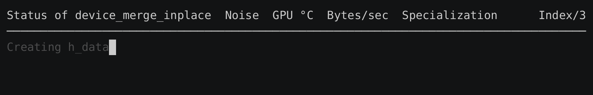
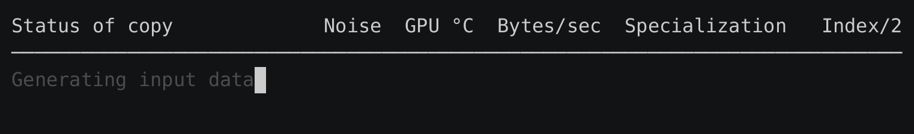

# primbench

primbench is a single-header HIP benchmarking library.



## Features

- Simple benchmarking API
- Colored progress output
- Cooling and warming of GPU
- Batching and stream blocking
- Detailed JSON output
- Autotuning support

## Dependencies

primbench only has three dependencies:
- HIP
- AMD SMI (for querying live GPU statistics)
- C++17 or newer

## Noise

Noise is the variance in throughput between runs, measured as the [coefficient of variation](https://en.wikipedia.org/wiki/Coefficient_of_variation).

The main goal of primbench is to reduce the amount of noise, because when a benchmark has say 10% noise, it means that a 4% performance improvement can't be distinguished from noise.

Other processes running on the same GPU can introduce noise, so those processes should be stopped before running any benchmarks.

Benchmarks that have been noisy for more than 10 seconds are automatically timed out (customize using `--noise-timeout-secs`):



### Implementation

Kernels often only take a few microseconds to run on the GPU, leading to a lot of variance in how long each kernel call takes. For this reason, primbench calculates the noise across the last 10 *batches*, rather than the noise across the last 10 *kernel calls* (customize using `--batch-window-size`).

The number of kernel calls in a batch is dynamically decided, by doubling the number of kernel calls, until the batch takes *at least* 10 milliseconds to run on the GPU (customize using `--min-gpu-ms-per-batch`).

In some cases, the recorded start time occurs before the kernel actually begins executing, since event recording is asynchronous. To reduce this timing noise, primbench queues the start, kernel, and stop events together in one atomic sequence.

It does this by briefly blocking GPU execution with a lightweight spinlock kernel until all events are enqueued. Once queued, the block is released and execution proceeds:
```c++
block(stream);
hipEventRecord(start, stream);
kernel(stream);
hipEventRecord(stop, stream);
unblock(stream);
elapsed = stop - start;
```

## Example

Here is an example `copy_benchmark.cpp`:
```cpp
#include "primbench.hpp"

// Simple copy kernel
template<typename T, unsigned int BlockSize, unsigned int ItemsPerThread>
__global__ __launch_bounds__(BlockSize)
void copy_kernel(const T* input, T* output)
{
    unsigned int idx = threadIdx.x + blockIdx.x * BlockSize * ItemsPerThread;
#pragma unroll
    for(unsigned int i = 0; i < ItemsPerThread; ++i)
        output[idx + i * BlockSize] = input[idx + i * BlockSize];
}

template<typename T>
struct copy_benchmark : public primbench::benchmark_interface
{
    std::string algo() const override
    {
        return "copy";
    }

    std::string name() const override
    {
        // primbench::rough_name<T>() is an approximation using demangling
        return "{\"algo\":\"" + algo() + "\",\"type\":\"" + primbench::rough_name<T>() + "\"}";
    }

    // This contains both the setup and running of the benchmark
    void run(primbench::state& state) override
    {
        const auto& stream = state.stream;
        const auto& bytes  = state.bytes;

        // primbench::log() calls report progress in gray
        // They help with discovering slow setup steps
        primbench::log("Calculating items");
        size_t                 N              = bytes / sizeof(T);
        constexpr unsigned int BlockSize      = 256;
        constexpr unsigned int ItemsPerThread = 4;

        const size_t items_per_block = BlockSize * ItemsPerThread;
        const size_t items = items_per_block * ((N + items_per_block - 1) / items_per_block);

        primbench::log("Generating input data");
        std::vector<T> h_input(items);
        for(size_t i = 0; i < items; ++i)
            h_input[i] = T(i);

        primbench::log("Allocating output vector");
        std::vector<T> h_output(items);

        primbench::log("Allocating device memory");
        T* d_input;
        T* d_output;
        primbench::exit_on_hip_error(hipMalloc(&d_input, items * sizeof(T)));
        primbench::exit_on_hip_error(hipMalloc(&d_output, items * sizeof(T)));

        primbench::log("Copying to device");
        primbench::exit_on_hip_error(hipMemcpyAsync(d_input,
                                 h_input.data(),
                                 items * sizeof(T),
                                 hipMemcpyHostToDevice,
                                 stream));

        dim3 grid(items / items_per_block);
        dim3 block(BlockSize);

        // primbench uses this to calculates the items/sec and bytes/sec
        state.set_items(items);
        state.add_reads<T>(items);
        state.add_writes<T>(items);

        // This passes a lambda to primbench, which calls it many times
        // primbench completely handles synchronization
        state.run(
            [&] {
                copy_kernel<T, BlockSize, ItemsPerThread>
                    <<<grid, block, 0, stream>>>(d_input, d_output);
            });

        primbench::exit_on_hip_error(hipFree(d_input));
        primbench::exit_on_hip_error(hipFree(d_output));
    }
};

int main(int argc, char* argv[])
{
    primbench::executor executor(argc, argv, 128 * primbench::MiB);

    executor.queue<copy_benchmark<char>>();
    executor.queue<copy_benchmark<long long>>();

    executor.run();
}
```

After putting `primbench.hpp` next to it, the benchmark can be compiled and run like so:
```bash
hipcc -o copy_benchmark copy_benchmark.cpp -lamd_smi && ./copy_benchmark
```

It will output this `results.json`:
```json
{
    "context": {
        "results_version": "1.0.0",
        "general": {
            "algorithm": "copy",
            "specialization_count": 2,
            "gpu_name": "AMD Instinct MI210",
            "gpu_arch": "gfx90a",
            "library_build_type": "debug",
            "host_name": "rocinante",
            "date": "2025-11-12T10:42:05+00:00",
            "hip_version": "7.0.51831-a3e329ad8",
            "clang_version": "20.0.0git (https://github.com/RadeonOpenCompute/llvm-project roc-7.0.1 25314 f4087f6b428f0e6f575ebac8a8a724dab123d06e)"
        },
        "cli_settings": {
            "bytes": 134217728,
            "hot": false,
            "seed": 42,
            "json_out": "results.json",
            "min_gpu_ms_per_batch": 10,
            "min_secs": 1,
            "noise_timeout_secs": 10,
            "batch_window_size": 10,
            "noise_tolerance_percent": 1,
            "min_gpu_temp": 50,
            "max_gpu_temp": 60,
            "max_warming_secs": 60,
            "max_cooling_secs": 60,
            "output_hip_device_properties_context": false,
            "output_amdsmi_context": false,
            "output_batches": false,
            "spaces_per_indent": 4,
            "stream_blocking_timeout_secs": 10
        },
        "flags": {
            "sync": false
        }
    },
    "specializations": [
        {
            "index": 0,
            "human_name": "type: char",
            "bytes_per_second": 7.53921e+11,
            "items_per_second": 3.76961e+11,
            "bytes_per_item": 2,
            "items": 134217728,
            "noise_timeout": false,
            "noise_percent": 0.0528198,
            "name": "{\"algo\":\"copy\",\"type\":\"char\"}",
            "elapsed_secs": {
                "host": 1.01051,
                "gpu": 0.581301
            },
            "gpu_temp_celsius": {
                "start": 50,
                "end": 50
            },
            "calls": {
                "kernel_calls_per_batch": 32,
                "ms_per_batch": 11.3918,
                "batches": 51,
                "kernel_calls": 1632
            }
        },
        {
            "index": 1,
            "human_name": "type: long long",
            "bytes_per_second": 1.29898e+12,
            "items_per_second": 8.11861e+10,
            "bytes_per_item": 16,
            "items": 16777216,
            "noise_timeout": false,
            "noise_percent": 0.0610761,
            "name": "{\"algo\":\"copy\",\"type\":\"long long\"}",
            "elapsed_secs": {
                "host": 1.01461,
                "gpu": 0.462967
            },
            "gpu_temp_celsius": {
                "start": 50,
                "end": 52
            },
            "calls": {
                "kernel_calls_per_batch": 64,
                "ms_per_batch": 13.2281,
                "batches": 35,
                "kernel_calls": 2240
            }
        }
    ],
    "summary": {
        "noise_timeouts": 0,
        "elapsed_secs": {
            "host": 2.81215,
            "gpu": 1.04427
        }
    }
}
```

## Command-line options

You can pass `--help` to benchmarks to print the available options:

| Option                                   | Description                                                                                                                                                                        |
| ---------------------------------------- | ---------------------------------------------------------------------------------------------------------------------------------------------------------------------------------- |
| `--help`                                 | Display this help message.                                                                                                                                                         |
| `--bytes`                                | Size of the randomly generated input array in bytes. (default: 134217728)                                                                                                          |
| `--hot`                                  | Skip clearing the GPU cache between batch iterations. (default: 0)                                                                                                                 |
| `--seed`                                 | Seed used for input generation. (default: 42)                                                                                                                                      |
| `--json-out`                             | Path to write JSON benchmark results. (default: results.json)                                                                                                                      |
| `--min-gpu-ms-per-batch`                 | Minimum duration of a batch in milliseconds (GPU time). (default: 10)                                                                                                              |
| `--min-secs`                             | Minimum total benchmark duration in seconds (wall time). (default: 1)                                                                                                              |
| `--noise-timeout-secs`                   | Maximum total benchmark duration in seconds before timing out a noisy run (wall time). (default: 10)                                                                               |
| `--batch-window-size`                    | Number of batch times used in the noise (coefficient of variation) window to decide early stopping. (default: 10)                                                                  |
| `--noise-tolerance-percent`              | Noise tolerance of batch times in percent, used to determine early benchmark stopping. (default: 1)                                                                                |
| `--min-gpu-temp`                         | Minimum GPU temperature in °C. Too low slows benchmarks; too high increases noise. (default: 50)                                                                                   |
| `--max-gpu-temp`                         | Maximum GPU temperature in °C. Too low slows benchmarks; too high increases noise. (default: 60)                                                                                   |
| `--max-warming-secs`                     | Maximum seconds allowed for GPU warming before an error is thrown. (default: 60)                                                                                                   |
| `--max-cooling-secs`                     | Maximum seconds allowed for GPU cooling before an error is thrown. (default: 60)                                                                                                   |
| `--output-hip-device-properties-context` | Output a 'hip_device_properties' object in the context, containing GPU details. (default: 0)                                                                                       |
| `--output-amdsmi-context`                | Output an 'amdsmi' object in the context, containing GPU details. (default: 0)                                                                                                     |
| `--output-batches`                       | Output a 'batches' array for each specialization, containing per-batch details. (default: 0)                                                                                       |
| `--spaces-per-indent`                    | Number of spaces per indentation level in JSON output. Set to 0 for no indentation. (default: 4)                                                                                   |
| `--stream-blocking-timeout-secs`         | Maximum stream blocking duration in seconds before timing out. Stream is blocked while queueing kernel calls. Use `primbench::flags::sync` if kernel is synchronous. (default: 10) |

## Outputting the commit hash

If the macro `COMMIT_HASH` is defined at compile time, the corresponding Git commit hash is automatically included in `results.json` as `context.general.git_commit`:

```bash
hipcc -o copy_benchmark copy_benchmark.cpp -lamd_smi -DCOMMIT_HASH=\"$(git rev-parse --short HEAD)\" && ./copy_benchmark
```
